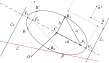

# Elipse

\begin{equation} 
f\left(k\right) = \binom{n}{k} p^k\left(1-p\right)^{n-k}
(\#eq:binom)
\end{equation} 
\@ref(eq:binom)

```{corollary}
The characteristic function of the sum of two independent random variables $X_1$ and $X_2$ is the product of characteristic functions of $X_1$ and $X_2$, i.e.,
$$\varphi _{X_1+X_2}(t)=\varphi _{X_1}(t) \varphi _{X_2}(t)$$
```

```{exercise, name="Characteristic Function of the Sample Mean"}
Let $\bar{X}=\sum_{i=1}^n \frac{1}{n} X_i$ be the sample mean of $n$ independent and identically distributed random variables, each with characteristic function $\varphi_{X}.$ Compute the characteristic function of $\bar{X}$. 
```

```{solution}
Applying Theorem, we have
$$\varphi _{\bar{X}}(t)=\prod_{i=1}^n \varphi _{X_i}\left(\frac{t}{n}\right)=\left[\varphi _{X}\left(\frac{t}{n}\right)\right]^n.$$
```  
  
Dados dos puntos distintos $F_1$ y $F_2$ llamados focos; la elipse $\mathcal{E}$ es el conjunto formado por  los puntos $P$ que satisfacen la ecuacion  $$\left|P-F_1\right|+\left|P-F_2\right|=2a.$$

$C=(h,k)$ es el centro de la elipse; $x'$ eje focal, $V_1$ y $V_2$ son los vértices de la elipse; $\overline{V_1V_2}$ el eje mayor $\overline{RR'}$ el lado recto; $\overline{B_1B_2}$ el eje menor de longitud $2b$. En el sistema $x'y'$ se tiene $B_1=(0,b)'$; $B_2=(0,-b)'$; $F_1=(-c,0)'$; $F_2=(c,0)'$  y $C=(0,0)'$. 
```{r pressure1, echo=FALSE, fig.cap="Elipse vectorial", fig.align="center"}

```

La excentricidad $e$ se define como

$$\frac{d\left[P;F_1\right]}{d\left[P;\mathcal{L}_1\right]}=e=\frac{d\left[P;F_2\right]}{d\left[P;\mathcal{L}_2\right]}$$

$d\left[B_i;F_1\right]=d\left[B_i;F_2\right]= a$ y $d\left[V_i;C\right]=d\left[V_i;C\right]=a$, $i=1,2$. $d\left[C;;\mathcal{L}_1\right]=d\left[C;\mathcal{L}_2\right]=\frac{a}{e}$ pues $\frac{d\left[B_i;F_1\right]}{d\left[B_i;\mathcal{L}_1\right]}=e\implies \frac{a}{d\left[B;\mathcal{L}_1\right]}=e$. Sea $c=d\left[P;F_1\right]=d\left[P;F_2\right]\implies c=ae$ pues $\frac{d\left[P;F_1\right]}{d\left[P;\mathcal{L}_1\right]}=e\implies \frac{a-c}{\frac{a}{e}-a}=e \implies c=ae$. $a>b$ y $a^2=b^2+c^2$; pues $a=d\left[B_1;F_2\right]=d\left[(0,b^2+c^2)';(c,0)'\right]^2=\sqrt{b}$; $0<e<1$ debido a que $0<e=\frac{a}{e}<1$ y $a>c>0$.

$P=(x,y)=C+x'\vec{u}+y'\vec{u}^\perp$; $x'=[(x,y)-C]\vec{u}$; $y'=[(x,y)-C]\vec{u}^\perp$

$F_1=C+c\vec{u}$ y $F_2=C-c\vec{u}$ entonces


\begin{align*}
\left|P-F_1\right|+\left|P-F_2\right|&=\left|C+x'\vec{u}+y'\vec{u}^\perp-C+c\vec{u}\right|\\
&\quad+\left|C+x'\vec{u}+y'\vec{u}^\perp-C-c\vec{u}\right|\\
&=\sqrt{(x'+c)^2+y'^2}+\sqrt{(x'-c)^2+y'^2}=2a\end{align*}


por lo tanto resolviendo $\sqrt{(x'+c)^2+y'^2}+\sqrt{(x'-c)^2+y'^2}=2a$ resulta $(a^2-c^2)x'^2+ay'^2=a^2(a^2-c^2)\implies b^2x'^2+a^2y'^2=a^2b^2$

De este modo $P\in\mathcal{E}$ si $P$ satisface la ecuación vectorial $$P=(x,y)=V+x'\vec{u}+y'\vec{u}^\perp;\: \text{donde } \frac{x'^2}{a^2}+\frac{y'^2}{b^2}=1; \:\left|\vec{u}\right|=1$$

Cuando el eje es paralelo al eje $x$; $\vec{u}=i=(1,0)$ entonces $(x,y)=V+x'\vec{u}+y'\vec{u}^\perp=(h+x',k+y')\implies x'=x-h$ y $y'=y-k$ en $\frac{x'^2}{a^2}+\frac{y'^2}{b^2}=1$ resulta $\frac{(y-k)^2}{a^2}+\frac{(y-k)^2}{b^2}=1$ ($\frac{x^2}{a^2}+\frac{y^2}{b^2}=1$ si $V$ está en el origen); entonces $F_1=C+c\vec{u}=(h+c,k)$; $\mathcal{L}_1: x=h+\frac{a}{e}$ y  $\mathcal{L}_2: x=h-\frac{a}{e}$.


Cuando el eje es paralelo al eje $y$; $\vec{u}=j=(0,1)$ entonces $(x,y)=V+x'\vec{u}+y'\vec{u}^\perp=(h-y',k+x')\implies x'=y-k$ y $y'=h-x$  en $\frac{x'^2}{a^2}+\frac{y'^2}{b^2}=1$ resulta $\frac{(y-k)^2}{a^2}+\frac{(y-k)^2}{b^2}=1$ ($\frac{x^2}{a^2}+\frac{y^2}{b^2}=1$ si $V$ está en el origen); entonces $F_1=C+c\vec{u}=(h+c,k)$; $\mathcal{L}_1: x=k+\frac{a}{e}$ y  $\mathcal{L}_2: x=k-\frac{a}{e}$.